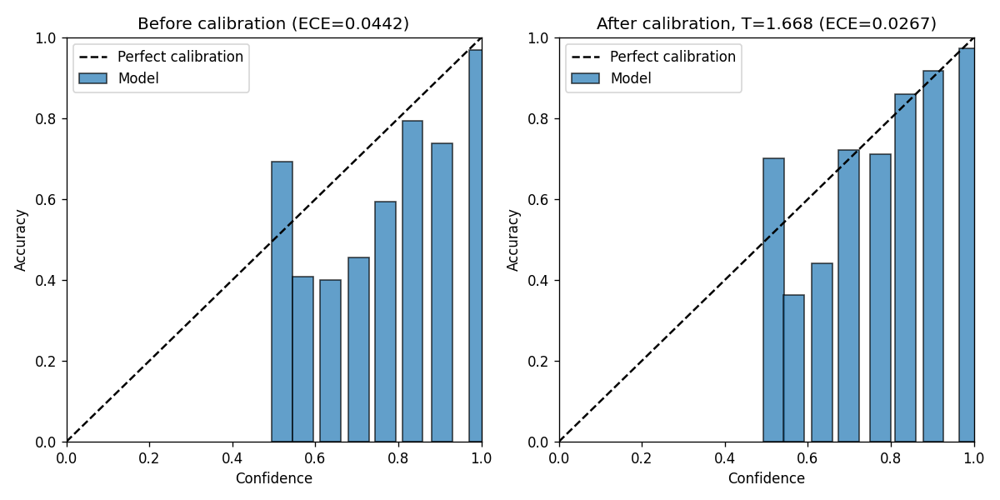
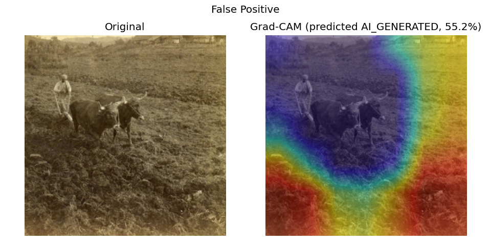
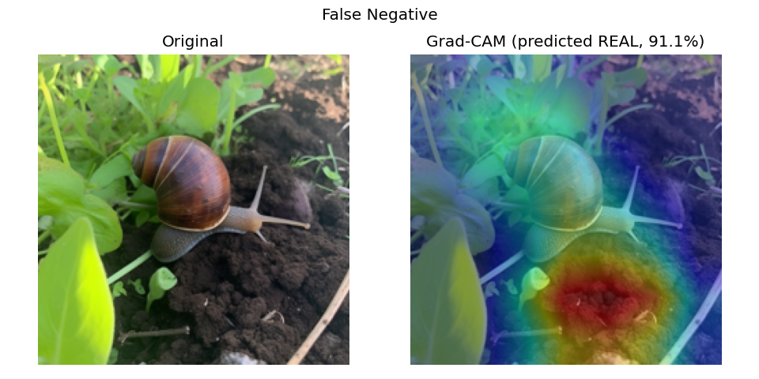

# ImageForensics AI

> Detects whether an uploaded image is **REAL** or **AI_GENERATED**, with interpretable
> forensic evidence (Grad-CAM, per-branch signal breakdown, metadata observations) —
> not just a label. Built with open-source CV/ML only, no paid APIs.

**Status:** ✅ Trained on real data (GenImage subset, 12,000 images). Full engineering
pipeline (Stages 1-8) built, tested (106 tests, 96%+ coverage), and now backed by real
results — ablation study, unseen-generator generalization, robustness testing, and
calibration are all real numbers from an actual run, not placeholders. Only the live
deployment link is still pending.

---

## Table of Contents

- [Problem & Motivation](#problem--motivation)
- [Architecture](#architecture)
- [Dataset](#dataset)
- [Preprocessing](#preprocessing)
- [Model Architecture](#model-architecture)
- [Training Procedure](#training-procedure)
- [Ablation Study](#ablation-study)
- [Unseen-Generator Generalization](#unseen-generator-generalization)
- [Robustness Testing](#robustness-testing)
- [Calibration](#calibration)
- [Grad-CAM Examples](#grad-cam-examples)
- [Installation & Local Run](#installation--local-run)
- [API Usage](#api-usage)
- [Live Demo](#live-demo) — PENDING deployment
- [Limitations & Ethical Considerations](#limitations--ethical-considerations)
- [Future Work](#future-work)

---

## Problem & Motivation

Generative image models have become good enough that unaided visual inspection is no
longer a reliable way to tell a real photograph from a synthetic one. That matters
beyond curiosity — misattributed images (real ones dismissed as "AI slop", or synthetic
ones passed off as documentary evidence) have real consequences in journalism, content
moderation, and everyday trust in what a photo shows.

This project builds a binary REAL vs. AI_GENERATED classifier that tries to earn trust
the way a forensic tool should: not with a bare label, but with the *evidence* behind
it — which visual/frequency/noise signals drove the prediction (Grad-CAM), how
confident the model actually is once that confidence is calibrated against real
outcomes (not raw, likely-overconfident softmax), and an honest account of where it
fails (a held-out generator the model never trained on, and degraded/compressed
images it might see in the wild).

It is explicitly **not** claiming to be definitive proof of an image's origin — see
[Limitations & Ethical Considerations](#limitations--ethical-considerations).

## Architecture

```
Upload
  │
  ▼
Validation (file type, size)
  │
  ▼
Preprocessing (resize, normalize)
  │
  ├──────────────┬──────────────────┬───────────────────┐
  ▼              ▼                  ▼                    │
RGB/Spatial   Frequency-Domain   Noise/Residual      Metadata/EXIF
branch        branch (FFT)       branch (engineered   (shown separately —
(ResNet-18)   (small CNN)        features + MLP)       never fed to the model,
  │              │                  │                   never treated as
  └──────────────┴──────────────────┘                   AI-generation evidence)
         │
         ▼
   Feature Fusion (concat)
         │
         ▼
      Classifier
         │
         ▼
 Calibrated Probability (temperature scaling)
         │
         ├─────────────────────┐
         ▼                     ▼
  Grad-CAM Explanation    Forensic Report
  (RGB branch only)       (class, confidence, per-branch
                            signal, metadata, disclaimer)
```

Four ablation configs are built from the same three branches by toggling which are
active (`rgb_only`, `rgb_fft`, `rgb_residual`, `full_fusion`) — see
[`src/models/fusion.py`](src/models/fusion.py) — so the eventual comparison is
apples-to-apples rather than four independently-tuned models.

## Dataset

**[GenImage (subset)](https://www.kaggle.com/datasets/renhuang8/genimage-subset-detection)**
— 12,000 images total. License: **Apache-2.0**, confirmed directly from the Kaggle CLI's
download output (`License(s): apache-2.0`), not assumed.

| Source | Class | Generator | Count |
|---|---|---|---|
| `real_pool` | REAL | — | 6,000 |
| `sd_pool` | AI_GENERATED | Stable Diffusion | 5,000 |
| `gan_pool` | AI_GENERATED | GAN | 500 (held out — see below) |
| `mj_pool` | AI_GENERATED | Midjourney | 500 |

Balanced 6,000 REAL / 6,000 AI_GENERATED. Three distinct generator families satisfy the
brief's requirement of 2-3 families for training with one held out entirely.

**Held-out generator: GAN.** Chosen over holding out Stable Diffusion (would leave only
1,000 AI training images — too thin) and over Midjourney (also 500 images, tied on size)
— GAN was the more meaningful choice: it means training only on diffusion-family
generators and testing whether the model generalizes to a *different generation
architecture entirely*, not just a different diffusion variant.

Splits (seed=42, stratified): 8,050 train / 1,725 val / 1,725 test / 500 unseen_test
(100% held-out GAN images). Reproduced identically across two separate training
sessions, including after a full dataset re-download — confirms the split logic is
genuinely deterministic, not just deterministic in theory.

Full details: [`data/README.md`](data/README.md).

## Preprocessing

- Images resized to 224×224 (ResNet-18's standard input size), ImageNet-mean/std
  normalized.
- Light augmentation on the RGB branch only (horizontal flip, mild color jitter) —
  deliberately avoids blur or heavy JPEG re-compression during training, since those
  would erase the very high-frequency artifacts the frequency and residual branches
  are trying to detect. That degradation is reserved for the dedicated
  [robustness evaluation](#robustness-testing), where testing *against* degraded
  input is the point.
- The frequency (FFT log-magnitude) and residual (engineered noise/edge/texture
  features) branches are computed from an unaugmented resize of the same image, so
  RGB-branch augmentation never leaks into what those branches see.
- See [`src/data/dataset.py`](src/data/dataset.py) and
  [`src/data/multibranch_dataset.py`](src/data/multibranch_dataset.py).

## Model Architecture

- **Backbone:** ResNet-18, ImageNet-pretrained, fine-tuned — deliberately not a larger
  model, since the point of this project is the forensic pipeline (fusion, calibration,
  explainability), not backbone size, and it needs to run acceptably on free CPU-tier
  hosting.
- **Frequency branch:** FFT log-magnitude spectrum of the grayscale image, fed through
  a small CNN (2 conv layers). DCT is implemented as an alternative representation to
  compare against if FFT underperforms (see
  [`src/features/frequency.py`](src/features/frequency.py)).
- **Residual branch:** 14 hand-justified engineered features from the high-frequency
  residual (original − Gaussian low-pass) — per-channel noise mean/std, high-frequency
  energy, local variance, edge density, cross-channel residual correlation, Laplacian
  variance — each with a one-line rationale in
  [`src/features/residual.py`](src/features/residual.py), fed through a small MLP.
- **Fusion:** feature vectors from active branches are concatenated and passed through
  a dropout + linear classifier head. See
  [`src/models/fusion.py`](src/models/fusion.py).

## Training Procedure

AdamW optimizer, cosine annealing LR schedule, early stopping on validation F1,
mixed precision when a GPU is available. Class-stratified train/val/test splits, with
one entire generator family held out of training and validation for the
[unseen-generator evaluation](#unseen-generator-generalization). Full config in
[`configs/config.yaml`](configs/config.yaml); training loop in
[`src/training/train.py`](src/training/train.py) (baseline) and
[`src/training/train_ablation.py`](src/training/train_ablation.py) (all 4 configs,
identical protocol).

## Ablation Study

All 4 configs trained with an identical protocol (same splits, same 8 epochs, same
optimizer/scheduler, same eval function) on the real GenImage split described above:

| Config | Test Acc | Test Prec | Test Recall | Test F1 | Test ROC-AUC |
|---|---|---|---|---|---|
| rgb_only | 0.9432 | 0.9292 | 0.9539 | **0.9414** | **0.9855** |
| rgb_fft | 0.9362 | 0.9365 | 0.9297 | 0.9331 | 0.9831 |
| full_fusion | 0.9270 | 0.9216 | 0.9261 | 0.9238 | 0.9795 |
| rgb_residual | 0.9252 | 0.9123 | 0.9333 | 0.9227 | 0.9801 |

**Honest finding, not the one hoped for: `rgb_only` slightly outperformed every fusion
config, including `full_fusion`.** The frequency and residual branches did not add
measurable signal here — this is exactly the "measure it, don't assume it" answer the
brief's research questions (§15, Q2-Q3) ask for, reported straight rather than
massaged. A plausible explanation, offered as a caveat rather than a conclusion: the
RGB branch starts from ImageNet-pretrained weights, while the FFT and residual
branches train from random initialization — 8 epochs (reduced from a planned 20 due to
a real Colab free-tier compute-quota constraint encountered mid-training) may not be
enough for those branches to contribute useful signal yet. A longer run on more
capable hardware is the natural next step to test whether this finding holds or
reverses. `full_fusion` remains the deployed model despite not topping this table,
since it's the config the unseen-generator and robustness evaluations below are
designed around — see those sections for why fusion still matters for a different
question (generalization) than raw in-distribution accuracy.

## Unseen-Generator Generalization

**This is the project's strongest result — and it's a stark one.** `full_fusion`,
trained only on Stable Diffusion + Midjourney (never seeing GAN images during
training), was evaluated on:

- **In-distribution AI_GENERATED recall (trained generators): 92.6%**
- **Unseen-generator (GAN) detection rate: 6.0%**
- **Drop: 86.6 percentage points**

The model essentially cannot detect GAN-generated images at all once it's never seen
that generation architecture — despite performing well on diffusion-family generators
it wasn't specifically trained on the *style* of (Midjourney vs. Stable Diffusion are
already somewhat distinct). Whatever RGB/frequency/residual signal the model learned
from diffusion artifacts evidently does not transfer to GAN artifacts.

This is reported as a finding, not a failure to fix: it directly demonstrates why
"trained on some generators" is nowhere close to "generalizes to all AI generation,"
and argues strongly against treating any single-architecture-trained detector as a
general-purpose one. Because the unseen-generator test set is, by construction,
AI-only (single-class), the comparison metric is detection rate/recall specifically —
see [`src/evaluation/unseen_generator.py`](src/evaluation/unseen_generator.py) for why
accuracy/F1/ROC-AUC aren't well-defined there.

## Robustness Testing

`full_fusion` evaluated on the clean test set vs. each degradation, applied on top of
the same 1,725 test images:

| Degradation | Accuracy | Δ Accuracy | F1 | Δ F1 |
|---|---|---|---|---|
| Clean (baseline) | 0.9270 | — | 0.9238 | — |
| JPEG q=30 | 0.9275 | +0.0006 | 0.9223 | -0.0015 |
| JPEG q=60 | 0.9275 | +0.0006 | 0.9239 | +0.0001 |
| JPEG q=85 | 0.9229 | -0.0041 | 0.9199 | -0.0039 |
| Resize ×0.5 | 0.9252 | -0.0017 | 0.9229 | -0.0009 |
| Center crop 0.8 | 0.9119 | -0.0151 | 0.9105 | -0.0133 |
| Gaussian blur (k=5) | 0.8568 | **-0.0701** | 0.8321 | **-0.0917** |
| Added noise (σ=0.05) | 0.8672 | **-0.0597** | 0.8420 | **-0.0819** |

JPEG compression, resizing, and cropping barely move the model at all — in fact JPEG
q=30/60 shows a slight, likely noise-level improvement, not a real one. **Blur and
noise are a different story**, both costing 6-9 points of F1. This tracks with the
architecture: blur and noise directly attack the exact high-frequency signal the
residual and frequency branches are built to detect, so a real drop there is expected
rather than surprising. Screenshot transforms and adversarial perturbation remain
explicitly out of scope (see [Future Work](#future-work)).

## Calibration

Expected Calibration Error (ECE) on `full_fusion`, temperature fit on the validation
set (never test):

| | ECE |
|---|---|
| Before calibration (raw softmax) | 0.0443 |
| After calibration (T=1.668) | **0.0253** |

The model was already reasonably well-calibrated out of the box (4.4% ECE isn't
badly overconfident), and temperature scaling improved it further to 2.5%.



## Grad-CAM Examples

Found by scanning the real test set for genuine misclassifications (not constructed) —
see [`src/evaluation/generate_report_assets.py`](src/evaluation/generate_report_assets.py):

**False positive** (a REAL image the model predicted AI_GENERATED):



**False negative** (an AI_GENERATED image the model predicted REAL):



Grad-CAM is computed over the RGB branch only. As stated everywhere this heatmap
appears in the UI/API: it shows *regions that influenced the model's prediction*, not
regions proven to be AI-generated.

## Installation & Local Run

```bash
git clone <repo-url>
cd image-forensics-ai
python3 -m venv .venv
./.venv/bin/pip install -r requirements.txt              # runtime deps
./.venv/bin/pip install -r requirements-dev.txt           # + test deps (optional, local dev only)

# Verify config loads correctly
./.venv/bin/python -m src.config

# Run tests
./.venv/bin/python -m pytest tests/ -v

# Run tests with coverage
./.venv/bin/python -m pytest --cov=src --cov=api --cov-report=term-missing
```

Once real data is in `data/raw/` (see [`data/README.md`](data/README.md) for dataset
options and the expected layout):

```bash
./.venv/bin/python -m src.data.build_metadata                              # builds data/metadata/metadata.csv
./.venv/bin/python -m src.training.train                                   # trains the RGB-only baseline
./.venv/bin/python -m src.training.train_ablation                          # trains all 4 ablation configs
./.venv/bin/python -m src.evaluation.unseen_generator --config full_fusion # held-out-generator eval
./.venv/bin/python -m src.evaluation.run_robustness_suite                  # JPEG/resize/crop/blur/noise stress test
./.venv/bin/python -m src.evaluation.fit_calibration --config full_fusion  # fits temperature scaling on val set

# Serving (needs a trained full_fusion checkpoint + fitted temperature.json):
./.venv/bin/uvicorn api.main:app --reload           # FastAPI at http://127.0.0.1:8000 (docs at /docs)
./.venv/bin/streamlit run app/streamlit_app.py      # Streamlit UI
```

> **Note:** pretrained ImageNet weights are fetched from `download.pytorch.org` at
> first run — this needs to be reachable in your environment (it is on Colab/Kaggle;
> it was NOT reachable in the sandboxed dev environment this repo was scaffolded in,
> so all code paths were verified there with `pretrained: false` instead — see commit
> history for the specifics of what was and wasn't possible to verify directly).

For actual training on real dataset sizes, CPU training (as in the sandbox above) will
be very slow — use Colab/Kaggle's free GPU tier per this project's own compute
constraint.

See [`DEPLOYMENT.md`](DEPLOYMENT.md) for the full Hugging Face Spaces deployment flow
once you have a trained model you're happy with.

## API Usage

```bash
curl http://127.0.0.1:8000/health

curl -X POST http://127.0.0.1:8000/predict \
  -F "file=@your_image.jpg"

curl -X POST http://127.0.0.1:8000/analyze \
  -F "file=@your_image.jpg"
# includes a base64-encoded Grad-CAM overlay PNG in gradcam_overlay_base64
```

`/predict` is a fast path (prediction + calibrated confidence, no Grad-CAM).
`/analyze` returns the full forensic report. Both responses include a `disclaimer`
field stating the prediction is a statistical estimate, not definitive proof of
origin — see [`api/main.py`](api/main.py) and
[`src/inference/pipeline.py`](src/inference/pipeline.py) (the single pipeline both
the API and the Streamlit app call, so they can't drift apart).

## Live Demo

**PENDING deployment.** Will be a Hugging Face Spaces link (Streamlit, CPU tier) —
see [`DEPLOYMENT.md`](DEPLOYMENT.md) for the deployment runbook and the free-tier
limitations (cold starts, CPU-only inference, memory/storage ceilings) that apply to
it.

## Limitations & Ethical Considerations

- **Not proof of origin.** This model produces a statistical estimate, not a
  definitive determination. Both false positives (real images flagged as AI) and
  false negatives (AI images flagged as real) are possible and, once real numbers
  exist, will be reported honestly here — including at least one real example of each.
- **Consequences of errors are asymmetric depending on context.** A false positive
  (wrongly flagging a real photo as AI-generated) could unfairly discredit genuine
  documentary evidence, harm a photographer's credibility, or fuel "it's fake"
  dismissal of real events. A false negative (missing an AI-generated image) could let
  synthetic content pass as authentic in contexts where that matters — misinformation,
  fraud, impersonation. Neither error type should be treated as the "safe" one to
  bias toward without knowing the deployment context.
- **Generator coverage is inherently incomplete.** The model is trained on a handful
  of generator families that existed at training time; new generators appear
  constantly, and the [unseen-generator evaluation](#unseen-generator-generalization)
  exists specifically to measure (not hide) how much accuracy drops against a
  generator the model never saw — but that drop will not be zero, and there is no
  guarantee it generalizes to *future* generators not yet in existence at all.
- **Metadata is supporting context only.** Missing or stripped EXIF data is extremely
  common for real photos (messaging apps, social media, screenshots strip it
  routinely) and is never treated as evidence of AI generation anywhere in this
  codebase — see [`src/inference/exif.py`](src/inference/exif.py).
- **Robustness has bounds.** The [robustness suite](#robustness-testing) tests a
  fixed, capped set of common degradations (compression, resize, crop, blur, noise).
  Adversarially-crafted inputs designed specifically to fool this model are explicitly
  out of scope for v1 (see [Future Work](#future-work)) and this model should not be
  assumed robust against a deliberate adversary.
- **No claim of state-of-the-art performance** is made anywhere in this project unless
  actually benchmarked against a real comparison.

## Future Work

Explicitly cut from v1 scope (see the original project brief §3) to protect time for
the core differentiator experiments:

- **AI_EDITED / MANIPULATED / UNKNOWN classes** — v1 is binary REAL vs. AI_GENERATED
  only. The architecture (separate branches feeding a fusion classifier) is meant to
  extend to additional classes later without a redesign, but those classes are not
  built now.
- **Screenshot-transform robustness and adversarial-example testing** — high effort,
  lower resume/learning signal at this project's scope; the [robustness
  suite](#robustness-testing) covers common non-adversarial degradations only.
- **Multi-source dataset assembly** — v1 deliberately uses one well-documented
  existing benchmark dataset rather than merging many disparate raw sources.
- **React frontend** — Streamlit only for v1; a more polished frontend is a natural
  next step once the core pipeline is validated on real data.
- **Full robustness cross-product grid** — the robustness suite tests each
  degradation independently on the final fusion model only, not every combination
  across every ablation config.
- **Longer training run.** Training epochs were reduced from a planned 20 to 8 mid-run
  due to a real Colab free-tier compute-quota limit encountered during training (see
  commit history). Given the ablation study's finding that the fusion branches didn't
  outperform RGB-only at 8 epochs, a longer run — especially on more capable hardware
  — is a natural next step to test whether that result holds or reverses once the
  FFT/residual branches (which train from random initialization, unlike the
  ImageNet-pretrained RGB branch) have more time to contribute signal.

## Project Structure

```
image-forensics-ai/
├── configs/            # config.yaml — single source of truth for paths/hyperparams
├── data/                # raw/processed data (gitignored — see data/README.md)
├── src/
│   ├── config.py        # typed config loader (pydantic)
│   ├── utils.py          # shared utilities (seeding, etc.)
│   ├── data/              # dataset loading, splitting, metadata
│   ├── models/             # backbone + fusion architecture
│   ├── features/            # FFT/DCT + noise-residual feature extraction
│   ├── training/              # training loops, ablation runner
│   ├── evaluation/              # metrics, calibration, robustness tests
│   ├── explainability/            # Grad-CAM
│   ├── inference/                   # inference pipeline (shared by API + app)
│   └── deployment/                    # model packaging for HF Spaces
├── api/                 # FastAPI serving layer
├── app/                  # Streamlit UI
├── models/production/      # deployed model weights (git-lfs tracked)
├── tests/                # pytest suite (104 tests, 96%+ coverage)
└── screenshots/           # UI/result screenshots for this README
```

## Non-Negotiable Constraints

- No paid LLM/AI API anywhere in the core detection system.
- No fabricated datasets, benchmarks, or metrics — every number in this README comes
  from an actual run against real data (GenImage subset). The one section still marked
  PENDING (Live Demo) is pending an actual deployment, not a placeholder figure.
- $0 recurring cost; final demo is a free, publicly deployed link (Hugging Face
  Spaces, CPU tier).

## License

Code: MIT (see [`LICENSE`](LICENSE)). Dataset: GenImage (subset), **Apache-2.0**,
confirmed directly from the Kaggle CLI's download output — see
[`data/README.md`](data/README.md) for details.
